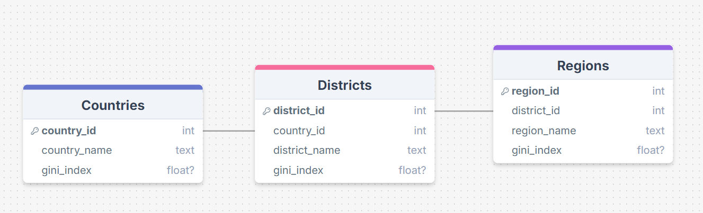

# RC-TechnicalChallenge

## Project Overview

The challenge presented consisted on extracting the "1991 gini index demographic census" from the IBGE website and implementing a database for persistent data storage. A few requirements were given:

* Use a SOLID Object-Oriented Programming approach
* Containerize the solution
* Make the code available on GitHub

The data was available through https://www.ibge.gov.br/ at the time of the challange (12th of October 2024)


## Code Structure

The project can be divided in three major parts:

1. The extraction of information from the website;
2. Transforming the data in a workable dataset;
3. Generating a Database to hold this information.

Given the requirement of a SOLID OOP approach, the project architecture implements classes with defined responsibilities in mind.

### CensusExtractor:

This class is responsible for the web scrapping component of the application. It's declarion is present on "scrapper.py".

Through some manual exploration of the target website, it was possible to identify relevant endpoints:

*https://ftp.ibge.gov.br/Censos/Censo_Demografico_1991/Indice_de_Gini* - Returns a table with information on all available zip files for the 1991 gini index demographic census

*https://ftp.ibge.gov.br/Censos/Censo_Demografico_1991/Indice_de_Gini/{filename}.zip* - Using the previous list, allows us to directly download each zip file.

The use of this class is as follows:

```python
    extractor = CensusExtractor(zip_dir)
    if not extractor.run():
        print("Terminating execution - extraction failed")
        return
```

The CensusExtractor object only needs the target directory (to where zip files will be stored) in order to be initialized.

The method run() is the only call that is needed to procede with the extraction and storage of the zip files. HTTP requests are handled via the requests library and the subsquest data wrangling is done via BeautifulSoup4. All this is done via private methods that are implemented in the class declaration.


### ZipParser:

The next step is to transform these .zip files in workable data. The use of this class is very similar to CensusExtractor, as the user only needs to initilize an object and call run() on it, giving it a few parameters: 

* unzip_dir - the target directory for the unzipped files,
* zip_dir - the directory where the zip files are located,

* zip_list - the list of zip file names to be considered.

```python
    unzipper = ZipParser(unzip_dir)
    df_country,df_district,df_region = unzipper.run(zip_dir, extractor.get_zip_list())
    if df_country.empty or df_district.empty or df_region.empty:
        print("Terminating execution - dataframe creation failed")
        return
```

The method run() is solely responsible for the creation of dataframes from the .zip files. This includes the uncompression of the .zip files, reading the resulting .csv files, creating dataframes (in which structures follow the database schema), cleaning the data (droping duplicates and null regional values, indexing correctly to ensure unique_ids, etc) and returning the dataframes for the countries, districts and regions presented in the source data.


### Connector and Database:

As the name implies, the connector is responsible for all interactions between the application and the SQL database. It follows the adapter [design pattern](https://refactoring.guru/design-patterns/adapter) to ensure the provided dataframes are correctly inserted in the db tables.

Furthermore, it also implements an method to query the database - get_gini_from_db() - creating an abstraction layer between the user and the database. Nevertheless, the user can also just call query_from_db() to directly do a standard SQL query.

The Connector object requires a database name to be provided. If not already created, this initilization will create the .db file and all tables.

```python
    connector = Connector(db_name)
    if not connector.populate_tables(df_country,df_district,df_region):
        print("Terminating execution - table population failed")
        return
```

For the project database, python's sqlite3 was used. As such, all table creations and queries follow the SQL syntax.

The database schema is the following:



Although simple, this schema does not compromise scalability, allowing for whatever future entry values that follow the country/district/region logic. The 'name' fields could've been considered a valid candidate for primary key, but I believe the best practice was to create unique id's for every table.


## Instalation

The project was done with Docker as its container builder.

1. Clone this repository:

   ```bash
   git clone https://github.com/eduardoparracho/RC-TechnicalChallenge.git
   cd RC-TechnicalChallenge
   ```
2. Make sure Docker is installed on your machine - https://docs.docker.com/get-started/get-docker/
3. Build the docker Image:

   ```bash
   docker build -t my-app-name .
   ```
4. Run the Docker Container (make sure to include '-it' in order to access the visualization commands):

   ```bash
   docker run -it -p 4000:80 rc-technicalchallenge
   ```


## Author

Eduardo Parracho, eduardofilipe.parracho@gmail.com
